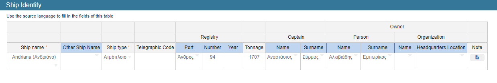

# Design of the Configuration files

In this section we'll show a step to step guide on how to define the configuration files. 

## 1. The 'templates.json' configuration file

In this file, we provide for each different type of archival source:
1. A category name
(used for grouping the different types of sources)
2. An ID (used for creating the
links to the transcripts), 
3. A name (shown in the UI),
4. A description (shown in the UI),
5. The name of the the source's configuration file.

The file has the following format:

```json
[
   {
      "category": "The Category to which source 1 belongs",
       "id": "The id of source 1 in FastCat",
       "name": "The name of source 1 in FastCat",
       "description": "The description we want source 1 to have",
       "configuration": "The name of the configuration file of source 1"
    },
    {
       "category": "The Category to which source 2 belongs",
       "id": "The id of source 2 in FastCat",
       "name": "The name of source 2 in FastCat",
       "description": "The description we want source 2 to have",
       "configuration": "The name of the configuration file of source 2"
   },
   . . .
   // example
   {
      "category": "Censuses",
      "id": "Census_LaCiotat",
      "name": "Census La Ciotat",
      "description": "The listes de dénombrement de la population, or otherwise nominative censuses, are a complete record of the population, and are therefore acknowledged as the best source of information for population analysis...",
      "configuration": "censuslaciotat_conf.json"
   }
]
```

## 2. The configuration file of each source type

In the configuration file for each source, we define 
1. The entity categories (e.g., persons, ships, etc.) that appear in records of this source type and which will be available for exploration.
2. For each entity category, the JSON fields that provide entity-related information like properties of the entity or its relations to other entities.
3. The JSON fields that define the name of a source record, needed for the UI and the creation of the links.

Lets see what a simple version of a configuration file for a archival source looks like:

```json
{
    "The name of the archival source": {
        "The name of the entity 1": {
            "The name of the field/column 1": {
                "path": "docs[0].data.ship_records.ship_name" 
                // the path of the value from the json object of the record
            },
            "The name of the field/column 2": {
                "path": "docs[0].data.ship_records.ship_type"
            },
            . . .
            "The name of the field/column N": {
                "path": "docs[0].data.ship_records.ship_type"
            },
            "The name of the entity 2": {
                "link": "The name of the entity 2", // Thats how we define the linking between entities. Instead of the key `path` we privide the key `link` with the name of the entitie that we want to link. Meaning when the user clicks on entitie 1 he will see information about the entitie 2 if they have a reation.
                "Id": "docs[0]._id"
            },
        },
        "The name of the entity 2": {
            "The name of the field/column 1": {
                "path": "docs[0].data.ship_records.captain_name"
            },
            "The name of the field/column 2": {
                "path": "docs[0].data.ship_records.captain_surname"
            }
        },
    },
    "Title": [ // The information that we want the title of a record to have
        "docs[0].data.ship_records.ship_name",
        "docs[0].data.ship_records.ship_type",
        "docs[0].data.source_identity.book_date_from",
        "docs[0].data.source_identity.book_date_to",
        "docs[0].data.record_information.name",
        "docs[0].data.record_information.surname",
        "docs[0].data.record_information.catalogue_id"
    ]
 
}
```
<br>

### Configuring the entities 

A more in depth look in the creation of an entity.

In the FastCat application the data entry can be done in:

1. Tables with only one entry



This is the simplest form of data entry and an entity tha has data from a table like this has the following format:

```json
"The name of the entity 1": {
    "The name of the field/column 1": {
        "path": "docs[0].data.ship_records.ship_name" 
        // the path of the value from the json object of the record
    },
    "The name of the field/column 2": {
        "path": "docs[0].data.ship_records.ship_type"
    },
    . . .
    "The name of the field/column N": {
        "path": "docs[0].data.ship_records.ship_type"
    }
}
```

2. Tables with multiple entries


If an entity has data from a table like this it must have the following format:

```json
"The name of the entity N": {
    "value-type": "list",
    "The name of the field/column 1": {
        "path": "docs[0].data.voyages.#.route_from"
    },
    "The name of the field/column 2": {
        "path": "docs[0].data.voyages.#.route_to"
    },
    ...
    "The name of the field/column N": {
        "path": "docs[0].data.voyages.#.date_from"
    }
}
```

3. Nested tables


If an entity has data from a table like this it must have the following format:

```json
"The name of the entity N": { 
    "value-type": "nested-list",
    "The name of the field/column 1": {
        "path": "docs[0].data.voyages.#.route_from"
    },
    "The name of the field/column 2": {
        "path": "docs[0].data.voyages.#.route_to"
    },
    ...
    "The name of the field/column N": {
        "path": "docs[0].data.voyages.#.date_from"
    }
}
```

If the entity we want to create contains data from a table with multiple entries or a nested table and therefore gets many values from each record, this must be reported by adding the "value-type" key that gets the "list" value for a table with multiple entries or "Nested-list" for nested table and in the path it needs the addition of "#" at the point where the table is indexed.

The application also allows an entity containing table data with multiple entries to add one or more columns whose value is derived from an table with only one entry. This is done by adding to the column we want the key "value-type" that gets the value "nolist".

```json
"The name of the entity N": {
    "value-type": "list",
    "The name of the field/column 1": {
        "path": "docs[0].data.voyages.#.route_from"
    },
    "The name of the field/column 2": {
        "path": "docs[0].data.voyages.#.route_to"
    },
    ...
    "The name of the field/column N": {
        "value-type": "nolist",
        "path": "docs[0].data.ship_records.ship_name"
    }
}

```
And an entity containing nested table data to add one or more columns whose value is derived from a table with multiple entries. This is done by adding to the column we want the key "value-type" that gets the value "list".

```json
"The name of the entity N": {
    "value-type": "nested-list"
    "The name of the field/column 1": {
        "path": "docs[0].data.service_analysis.#.start_of_service"
    },
    "The name of the field/column 2": {
        "path": "docs[0].data.service_analysis.#.disembarkation_location"
    },
    ...
    "The name of the field/column N": {
        "value-type": "list",
        "path": "docs[0].data.list_of_registered_persons.#.person_name"
    }
}
```
<br>Example of the first case


<center>fastcat record data</center><br>

`Voyage` has data from the table `Voyages` with multiple vaules and fomr the table `ship identity` that has only one entry.


<center>Fastcat-Catalogues table</center><br>

### Configuring the relationships between the entities

<br>

For each entity we can create relationships with other entities. For example if a source has ships, ports, crew members etc. the user can visit a ship and see which ports the ship has gone to, which are its crew members etc.

1. To add a relation to an entity that contains data from a table with only one entry, with an entity regardless of type we add the name of the entity that we want as we did before for the columns but instead of "path" now we add the key "link" with a value of the name of the entity again and the key "Id" with value of the path of the id of the record.

```json
"The name of the entity 1": {
    "The name of the field/column 1": {
        "path": "docs[0].data.ship_records.ship_name"
    },
    ...
    "The name of the field/column N": {
        "path": "docs[0].data.ship_records.ship_type"
    },
    "The name of the entity 2": {
        "link": "The name of the entity 2",
        "Id": "docs[0]._id" // The Id of the record
    },
    "The name of the entity 3": {
        "link": "The name of the entity 3",
        "Id": "docs[0]._id"
    }
},
"The name of the entity 2": {
    ...
},
"The name of the entity 3": {
    ...
}
```

2. To add a relation to an entity that contains data from a table with multiple entries: <br> 
If the other entity contains data from: <br>
    1. Entity that contains data from a table with only one entry <br>
        * We do as before <br> 
    2. Entity that contains data from a table with multiple entries <br>
        * We do as before and adding the key "listLink" with the value true.<br> 
    3. Entity that contains data from a nested table <br>
        * We do as before and adding the key "listLink" with the value true and "link-type" with the value "l-nl"<br> 

```json
"The name of the entity 1": {
    "value-type": "list",
    "The name of the field/column 1": {
        "path": "docs[0].data.voyages.#.route_from"
    },
    ...
    "The name of the field/column N": {
        "path": "docs[0].data.voyages.#.route_from"
    },
    "The name of the entity 2": { // case 1
        "link": "The name of the entity 2",			
        "Id": "docs[0]._id"
    },
    "The name of the entity 3": { //case 2
        "link": "The name of the entity 3",						
        "listLink": true,
        "Id": "docs[0]._id"
    },
    "The name of the entity 4": { //case 3
        "link": "The name of the entity 4",						
        "link-type": "l-nl",
        "listLink": true,
        "Id": "docs[0]._id"
    }
},
"The name of the entity 2": { // case 1
    ...
},
"The name of the entity 3": { // case 2
    "value-type": "list",
    ...
},
"The name of the entity 4": { // case 3
	"value-type": "nested-list",
    ...
}
```

3. To add a relation to an entity that contains data from a nested table: <br> 
If the other entity contains data from: <br>
    1. Entity that contains data from a table with only one entry <br>
        * We do as before <br> 
    2. Entity that contains data from a table with multiple entries <br>
        * We do as before and adding the key "listLink" with the value true and "link-type" with the value "nl-l"<br> 
    3. Entity that contains data from a nested table <br>
        * We do as before and adding the key "listLink" with the value true and "link-type" with the value "nl-nl"<br> 

```json
"The name of the entity 1": {
    "value-type": "nested-list",
    "The name of the field/column 1": {
        "path": "docs[0].data.voyages.#.route_from"
    },
    ...
    "The name of the field/column N": {
        "path": "docs[0].data.voyages.#.route_from"
    },
    "The name of the entity 2": { // case 1
        "link": "The name of the entity 2",			
        "Id": "docs[0]._id"
    },
    "The name of the entity 3": { //case 2
        "link": "The name of the entity 3",	
        "link-type": "nl-l",					
        "listLink": true,
        "Id": "docs[0]._id"
    },
    "The name of the entity 4": { //case 3
        "link": "The name of the entity 4",						
        "link-type": "nl-nl",
        "listLink": true,
        "Id": "docs[0]._id"
    }
},
"The name of the entity 2": { // case 1
    ...
},
"The name of the entity 3": { // case 2
    "value-type": "list",
    ...
},
"The name of the entity 4": { // case 3
	"value-type": "nested-list",
    ...
}
```

## 2. Configuring the 'Explore all' functionality

For configuring the ‘Explore all’ functionality, we first need to define the
names of all the supported entity categories and their grouping in the ‘explore_all.json’ configuration file. Then, the file ‘explore_all_conf.json’ allows
configuring each of the entity categories, by defining the sources and the tables
in each source that provide instances. Then, all other information needed for
creating the entity tables is read from the source-specific configuration files.

1. The `explore_all.json` has the following format:

```json
{
    "The name of the entity 1": {},
    "The name of the entity 2": {
        "sub": { // Those that are in the sub are subcategories of entity 2
            "The name of the entity 3": {},
		 . . .
            "The name of the entity 4": {}
        }
    },
    // example
    "Ships": {},
    "Locations": {
        "sub": {
            "Route Ports": {},
            "Arrival Ports": {},
            "Birth Places": {},
        }
    }
}
```

1. The `explore_all_conf.json` has the following format:
Here we for each entity we define the sources and the tables
in each source that provide instances. Then, all the information needed for
creating the entity tables is read from the source-specific configuration files.
Those subcategories that exist inside a category must again be referred to as category outside of the scope of the key "sub" this is clear in the xample we provide we have the category Persons and inside it the subcategories Crew Members and Captains and the after the Persons we define again the Crew Members and Captains as categories on  there own.

```json
{
    "The name of the entity 1": {
        "The name of the archival source 1": {
            "The name of the entity from the archival source 1": {}
        },
	  . . .
        "The name of the archival source 2": {
            "The name of the entity from the archival source 2": {}
        }
    },
    "The name of the entity 2": {
	  "sub": {
            "The name of the archival source 1": {
                "The name of the entity from the archival source 1": {}
            },
            "The name of the archival source 2": {
                "The name of the entity from the archival source 2": {}
            }
        }
    },
    // Example
    "Ships": {
        "Accounts book": {
            "Ships": {}
        },
        "General Spanish Crew List": {
            "Ships": {}
        },
        "Crew and displacement list (Roll)": {
            "Ships": {}
        }
    },
    "Persons": {
        "sub": {
            "Crew Members": { // subcategorie of Persons
                "General Spanish Crew List": {
                    "Crew Members": {}
                },
                "Crew and displacement list (Roll)": {
                    "Crew Members": {}
                },
            },
		
            "Captains": { // subcategorie of Persons
                "Accounts book": {
                    "Captains": {}
                },
                "Logbook": {
                    "Captains": {}
                }
		}
        }	
    },
    "Crew Members": { // Those subcategories that have existed must again be referred to as categories
        "General Spanish Crew List": {
            "Crew Members": {}
        },
        "Crew and displacement list (Roll)": {
            "Crew Members": {}
        },
    },
    "Captains": {
        "Accounts book": {
            "Captains": {}
        },
        "Logbook": {
            "Captains": {}
        },
    }
}
```

Real implementations of the configuration files, the template file and the explore all files can be found in the folder api/ConfigFiles and the corresponding exported fastcat data are located in the folder api/data.

In this folder we have small sample of the configuration files that we use for the SeaLit project.  <br>
If anyone is interested in all the resources of SeaLiT contact this email: <fafalios@ics.forth.gr>
